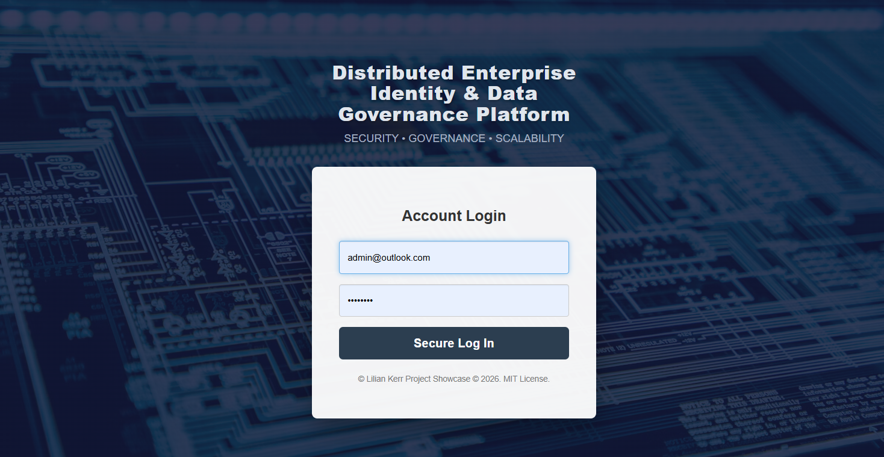
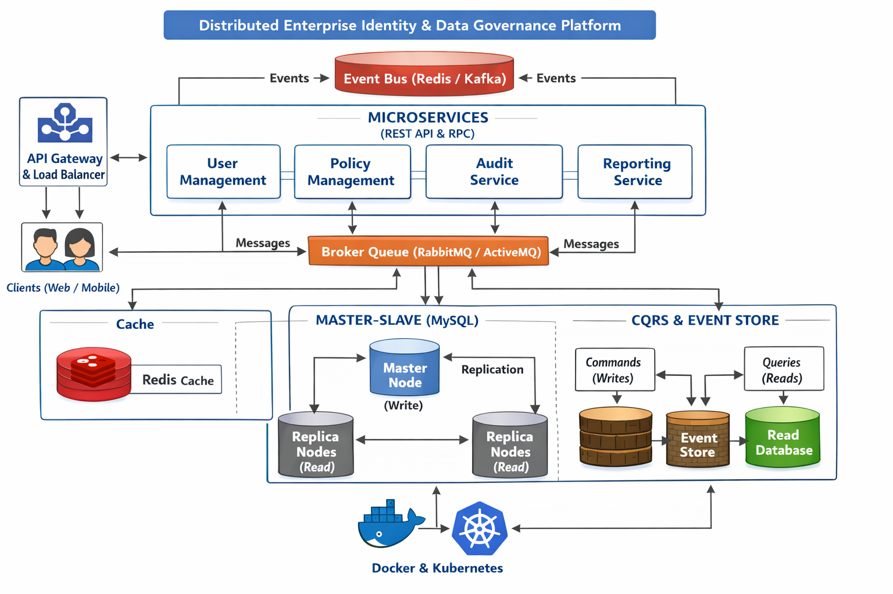
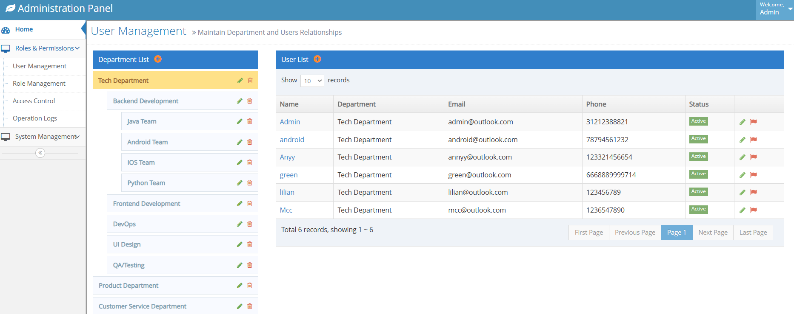
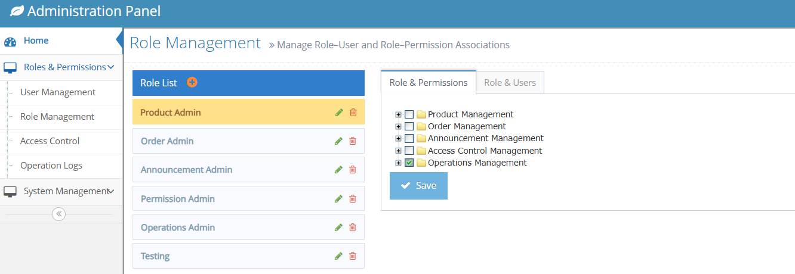
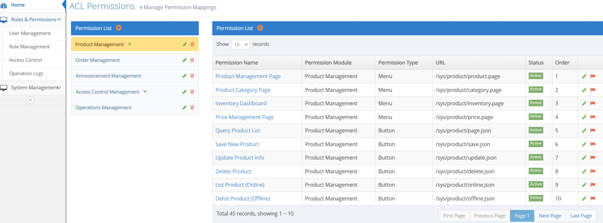
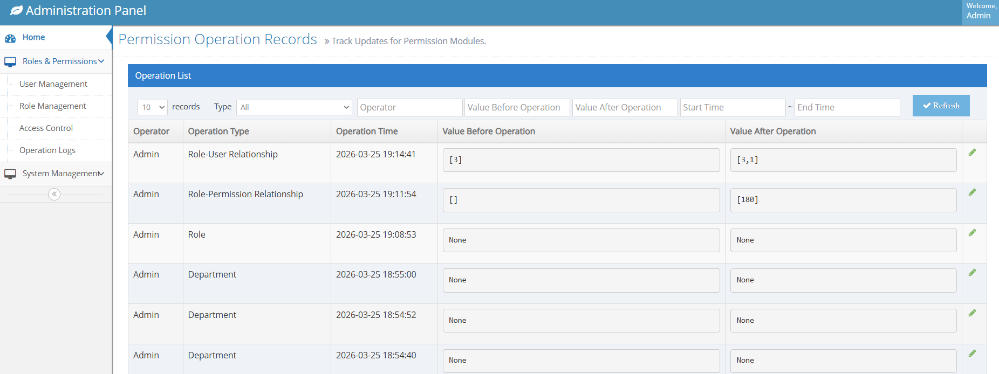
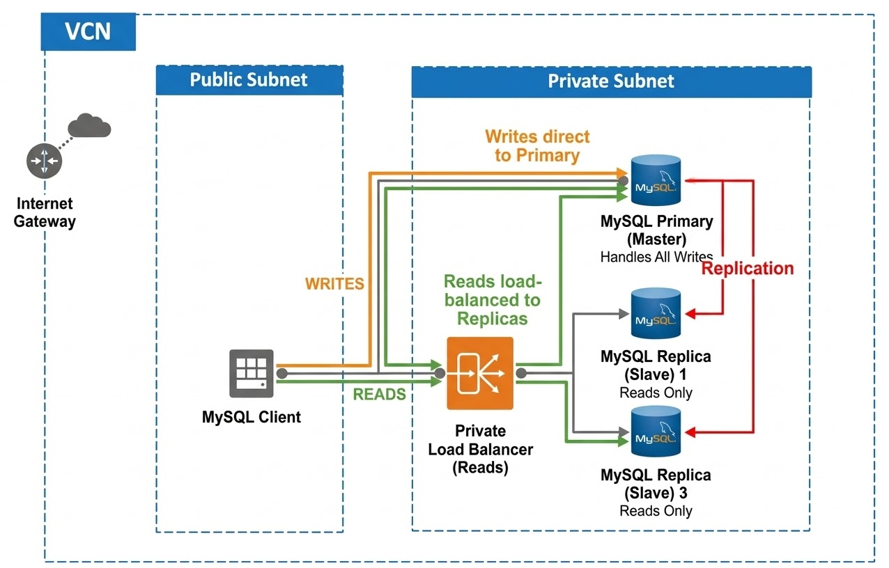
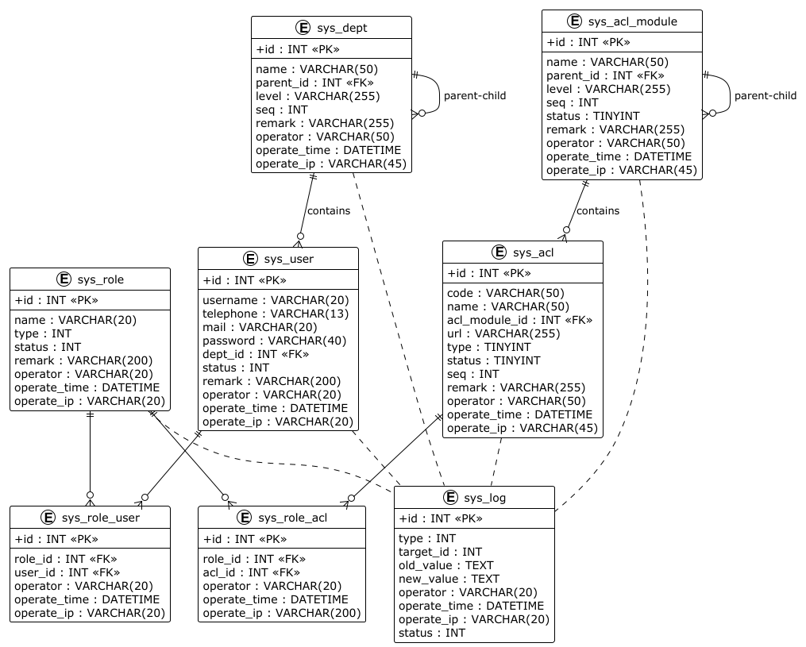

# Distributed Enterprise Identity & Data Governance Platform Showcase


# 1. Project Overview

The platform is a distributed Identity and Access Management (IAM) and data governance system designed to support complex organizational hierarchies and fine-grained authorization requirements. It features an advanced Role-Based Access Control (RBAC) model capable of representing hierarchical roles and enforcing precise, context-aware permissions across a multi-service ecosystem.

Built with a strong emphasis on scalability, high availability, auditability, and performance, the platform leverages modern distributed system design patterns to ensure data integrity and low-latency authorization at scale.

### Key architectural highlights include:

- **Domain-driven microservices architecture**: Independent services for core domains such as User Management, Policy Management, Audit, and Reporting, enabling modular development and scalability.
- **Layered service design**: Clear separation of concerns within each service (Controller → Service → Repository) to enhance maintainability and testability.
- **High availability data layer**: MySQL master-replica (primary-secondary) configuration to support failover and read scalability.
- **Caching and asynchronous processing**: Redis used for low-latency caching and pub/sub messaging to support event-driven workflows.
- **Event-driven communication**: Loose coupling between services via asynchronous events (e.g., role updates triggering audit logging and downstream notifications).
- **CQRS and Event Sourcing (selectively applied)**: Adopted for critical operations requiring full audit trails and historical state reconstruction.
- **Containerization and orchestration**: Docker and Kubernetes used for consistent deployment, service isolation, and dynamic scaling.
<br>



**In this project showcase, certain implementation details are intentionally simplified to focus on core system design principles, architectural trade-offs, and key technical decisions.**


### Core Value Proposition 
The platform solves the "Scale vs. Granularity" trade-off by decoupling
authorization logic from individual microservices. By implementing a Native
RBAC+ model, the system ensures that security policies remain consistent,
auditable, and easily modifiable without requiring code changes in
downstream services.

### Key Architectural Pillars
- Extended RBAC Modeling: Beyond simple "User-Role" mapping, the system 
incorporates hierarchical roles and resource-level granularity. 
This allows for "Inherited Permissions," where a regional manager 
automatically inherits the permissions of a branch lead, while maintaining 
the ability to restrict specific sensitive resources. <br><br>

- High-Concurrency Distributed Design: To avoid the latency bottlenecks common 
in centralized security, the platform utilizes stateless evaluation nodes. 
These nodes are horizontally scalable and can be deployed alongside microservices 
(Sidecar pattern) or as a dedicated cluster. <br><br>

- Vendor-Agnostic Core: The engine was built using native language implementations 
rather than proprietary third-party frameworks. This eliminated licensing overhead 
and "architectural debt," ensuring the platform remains portable across cloud 
providers (AWS, Azure, GCP) or on-premise infrastructure. <br><br>

- Dynamic Administrative Control: A dedicated Control Plane UI allows non-technical 
business stakeholders to manage roles and permissions in real-time. 
This shifts the burden of access management from DevOps tickets to business 
operations. <br><br>

<b>Disclaimer: This codebase is a personal reference implementation inspired by industry best practices and is not affiliated with any past or present employers. </b>


# 2. Business Context & Problem Statement

### Problems with Previous Solutions (The Silo Effect)
Before centralizing access management, organizations typically rely on decentralized or application-specific 
access controls. This creates several friction points:
- **The "Swivel-Chair" Administration:** Administrators have to manually grant permissions in ten different apps for one new hire. This is prone to human error—forgetting to revoke access when someone leaves is a massive security hole.<br>

- **Inconsistent Security Logic:** One app might use Role-Based Access Control (RBAC), while another uses Attribute-Based Access Control (ABAC). This makes it impossible to enforce a "universal" security posture. <br>

- **Permission Policy Drift:** Over time, permissions accumulate (privilege creep), and without a central source of truth, no one knows exactly who has access to what. <br>

- **Redundant Security Engineering:** Each new project requires rebuilding core security functionality, including authentication, authorization, and session management. It involves implementing login flows, MFA, token handling (JWTs), and cookie security across services. As a result, engineering effort is diverted from core business 
development, leading to duplicated work, inconsistent security practices, and increased maintenance overhead. <br>

- **The Fragmentation of "Source of Truth":** User data is duplicated across systems, requiring manual updates for changes in roles or attributes. This leads to inconsistent permissions, poor password hygiene, and higher operational overhead, increasing the risk 
of errors and outdated permissions. This fragmentation also forces users to manage separate credentials for each tool, leading to poor password hygiene, increased security risk, and higher administrative overhead.


# 3. System Architecture Overview

## 3.1 High-Level Architecture Diagram


## 3.2 Core Components

### User & Department Management Module

The User Management component serves as the central administrative hub for maintaining the relationship between organizational structures and individual user accounts. It implements a Master-Detail design pattern to manage complex hierarchical data.



<hr>

### Role & Permission Management Module

This component facilitates granular access control by decoupling user identities from system permissions. It allows administrators to define functional roles and map them to specific system capabilities and user groups.



<hr>

### ACL Permissions & Resource Mapping Module

The **ACL Permissions** component is the most granular level of the security architecture. It provides a registry for all securable resources within the application, mapping front-end interface elements to back-end route authorizations.



<hr>

### Operation Logs & Audit Trail Module
The Operation Logs module provides a comprehensive audit trail of all administrative actions within the system. It ensures accountability and transparency by recording state changes across departments, users, roles, and permissions.




# 3. Database Design
The database design adopts a high-availability data layer based on a MySQL primary–replica (master–replica) architecture to support failover and horizontal read scaling. The primary node handles all write operations, while replicas serve read-heavy workloads, reducing contention and improving overall system throughput. 



## 3.1 Schema Overview
The database schema design follows normalization principles while balancing performance considerations for high-frequency authorization queries. At a high level, the schema is organized around four core domains: Identity, Access Control, Policy Management, and Audit.

The schema consists of seven core functional domains:

**(1). Identity Domain** <br>
`sys_user`: Stores core identity information for each system user. <br>
Key responsibilities:<br>
- Stores login credentials and profile information
- Associates users with departments
- Maintains account lifecycle state (active, frozen, deleted)

**(2). Organizational Domain** <br>
`sys_dept`: Defines the hierarchical organizational structure. <br>

Key characteristics: <br>
- Self-referencing hierarchy via parent_id
- Materialized path (level) enables efficient tree traversal
- Supports unlimited hierarchical depth

**(3). Authorization Domain** <br>
This domain implements the RBAC authorization model.
`sys_role`: Defines logical groupings of permissions.
`sys_acl`: Defines individual permissions representing access to specific system resources.
`sys_acl_module`: Organizes permissions into hierarchical modules for administrative clarity.

**(4). Relationship Mapping Domain** <br>
These junction tables implement many-to-many relationships essential to RBAC:
`sys_role_user`: Maps users to roles. Relationship: User ←→ Role

`sys_role_acl`: Maps roles to permissions. Relationship: Role ←→ Permission
<br>
This indirection provides flexibility and scalability while avoiding direct user-permission coupling.

**(5). Audit Domain** <br>
`sys_log`: Provides a complete audit trail of system changes.
<br>
Tracks:
- Entity modifications
- Previous and new values
- Operator identity
- Timestamp and source IP
- Restoration status

This enables forensic analysis, rollback capability, and regulatory compliance.

## 3.2 Entity Relationships




# 4. Distributed Systems Design
### Layered Architectural Design
The project follows a clean, layered architecture to ensure maintainability and scalability:
- **Presentation (Controller Layer):** Spring MVC Controllers handling HTTP and Swagger annotations.
- **Business Logic (Service Layer):** Encapsulates business logic, validation, and audit logging.
- **Data Access (DAO/MapperLayer):** MyBatis XML Mappers for optimized SQL execution and flexible data modeling.
- **Security Context:** Custom RequestHolder to manage thread-local user sessions.
- using different POJOs (Model, DTO, Bean, Param) help decouple the database layer from the UI layer


```azure
+----------------------+       +----------------------+
|  Client / Frontend   | <---> |  Spring Boot API     |
+----------------------+       +----------------------+
                                   |
                                   v
                          +----------------------+
                          |  Service Layer       |
                          | - Role Management    |
                          | - Permission Checks  |
                          | - Audit Logging      |
                          +----------------------+
                                   |
                   +----------------+----------------+
                   |                                 |
          +----------------+               +----------------+
          |  MySQL DB      |               |  Redis Cache    |
          | - Users        |               | - Session Mgmt  |
          | - Roles        |               | - Hot Data      |
          | - Permissions  |               +----------------+
          | - Audit Logs   |
          +----------------+

```

TODO
```azure
Stateless Service Design
Horizontal Scaling Strategy
Caching Strategy
Consistency Model
Failure Handling
High Availability Strategy
```

# 5. Security & Audit Design
### Enterprise Auditing & Logging
- **State Tracking:** Captures "Before" and "After" snapshots for all entity modifications to support security compliance.
- **Automated Log Management:** Implements a professional logging strategy with automated rotation, timestamping, and GZ compression for long-term storage.

>TODO:

# 6. Project Stacks & Configuration 
### Tech Stack
- **Programming:** Java 17, SQL, JavaScript, jQuery, Ajax
- **Core Framework:** Spring Boot 3.2.6.
- **Persistence:** MyBatis 3.0.5 with high-performance XML-based mapping
- **Caching:** Redis (Jedis) for session and permission caching.
- **Utilities:** Google Guava, Lombok, Jackson.
- **Validation:** Hibernate Validator (JSR-303).
- **Testing:** JUnit 5, Mockito, MockMvc, and AssertJ.
- **Logging:** SLF4J with Logback-spring configuration for environment-aware logging

The system relies on environment variables to manage sensitive information and environment-specific settings. This approach ensures secure configuration and flexibility across different deployment environments (local, staging, production).

## Config Files
The system uses structured configuration files to manage application behavior and service integration.

- **application.yml / application-{profile}.yml:** Core Spring Boot configuration, including database connections, Redis setup, and service-level settings.

- **Profile-based configuration:** Different configurations are maintained for environments such as development, testing, and production to ensure proper isolation and tuning.

- **Externalized configuration:** Sensitive or environment-specific values are injected at runtime via environment variables or secret management systems.

The platform utilizes Spring Profiles for seamless transitions between development, testing, and production environments:
- **application-dev.yml:** Local development settings.
- **application-test.yml:** Specialized configurations for automated test runs.
- **application-prod.yml:** Hardened settings for production-grade deployments.

## Professional Logging Strategy

System logs are meticulously managed and stored in the logs/ directory:
- **Active Logs:** Real-time tracking in `data-governance-platform-info.log`.
- **Archived Logs:** Historic logs are automatically rotated, timestamped, and compressed (e.g., `info-2026-02-19.0.log.gz`) to optimize disk space while maintaining an audit trail.

## Multi-Tiered Testing Strategy

This project demonstrates a "test-first" engineering mindset with high test coverage. Reliability is enforced through a multi-tiered testing strategy:
- **Unit Tests:** Comprehensive mocking of service layers using Mockito. Intensive use of JUnit 5 and Mockito to isolate business logic.
- **Integration Tests:** Data-layer testing using @MybatisTest and in-memory H2 databases.
- **Web Layer Testing:** Utilizing MockMvc to verify endpoint security and response formats.
- **Bean Validation:** Independent testing of complex JSR-303 constraints in DTO/Param objects.
- **Concurency Testing TODO:** Conduct stress testing with JMeter and perform JVM performance tuning to ensure stability under high concurrency

# 7. Deployment Guide


## Local Development Setup

### Way 1. Local Execution
1. Clone repository: git clone https://github.com/yourusername/enterprise-identity-platform.git

2. Configure: Set up database and Redis in application.yml.

3. Run: mvn spring-boot:run

4. Monitoring: Access Druid at http://localhost:8082/druid/ (User: druid, Pin: 123456).

5. API UI: Explore via http://localhost:8082/swagger-ui.html.


#### Quick Tips for Windows Users
`mvnw.cmd` is a Maven Wrapper script for Windows. This script is a brilliant little tool designed to let us run a Maven project without actually having Maven installed on your machine.
The Maven Wrapper is a way to bundle a specific version of Maven with the project. This ensures that every developer on your team (and your CI/CD pipeline) uses the exact same version of Maven, avoiding the "it works on my machine" headache.

####  Common Use Cases

| Goal                   | Command               |
|------------------------|-----------------------|
| Build the project      | mvnw clean install    |
| Run a Spring Boot app  | mvnw spring-boot:run  |
| Check Maven version    | mvnw -v               |


- **Permission Issues:** Sometimes the script might not run if your execution policy is strict, though .cmd files usually bypass the hurdles that .sh or .ps1 files face.

- **Missing Java:** If you get the error JAVA_HOME not found, you'll need to set your environment variable to point to your JDK folder (e.g., C:\Program Files\Java\jdk-17).

- **Proxy Issues:** If you are behind a corporate firewall and mvnw fails to download Maven, you may need to configure proxy settings in your .mvn/wrapper/maven-wrapper.properties file.

#### 🛠 Troubleshooting mvnw Errors
If you run `mvnw clean install` or `./mvnw clean install` and encounter the following error:

Error: Could not find or load main class org.apache.maven.wrapper.MavenWrapperMain

**Why this happens:**
The mvnw script exists, but the essential .mvn/wrapper/maven-wrapper.jar file is missing. This often happens if .jar files are included in your .gitignore or if the folder wasn't included in the project copy.

**The Fix:** <br>
If you have Maven installed locally, run this command in your project root to regenerate the wrapper files: `mvn wrapper:wrapper`

**Note:** To prevent this in the future, ensure your .gitignore allows the wrapper JAR:
```azure
# Allow the Maven Wrapper executable
!.mvn/wrapper/maven-wrapper.jar
```

### Way 2. Running the Platform with Docker
This project is fully containerized to ensure a consistent runtime environment across development and production stages.

**1. Prerequisites**
- Docker Engine 20.10+ and Docker Compose V2.
- JDK 17 (The Docker multi-stage build will handle the compilation, so you don't need Maven installed locally).

**2. Standard Deployment**

Run the following command in the project root to build the images and start the cluster in detached mode:
```azure
# Build images and start all services (App, MySQL, Redis)
docker compose up --build -d
```

**3. Service Verification**
Once the containers are running, you can verify their health and connectivity:
- **API & Service Health:** Access the Swagger UI. If this page loads and allows you to "Try it out" on an endpoint (e.g., /sys/user/list.json), the Spring context and Service layer are healthy.
  URL: http://localhost:8082/swagger-ui.html

- **Database & Connection Pool:** Access the Druid Monitor Console. This provides real-time statistics on your connection pool and SQL execution.
  URL: http://localhost:8082/druid/index.html (User: druid / Pass: 123456)

- **Redis Status:** Test the cache connectivity. Use the Docker CLI to ping the cache:
```azure
docker compose exec redis redis-cli ping
```

## Production Deployment
Ref: TODO
## Kubernetes Deployment
Ref: TODO

# 8. Future Improvements
1) Implement RPC Endpoints
2) Integrate Load balancer 
